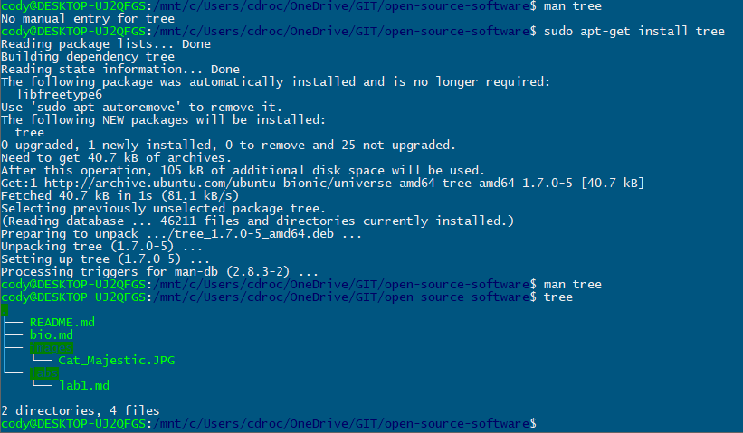
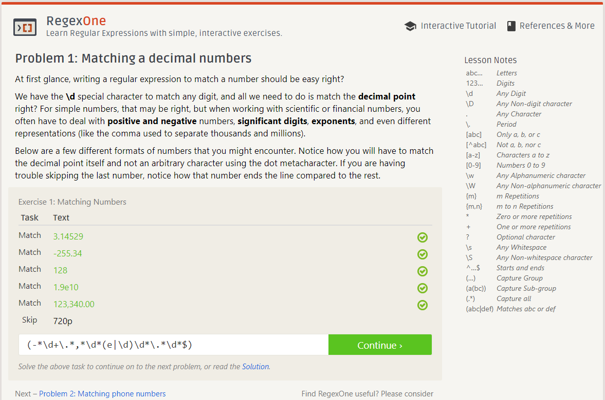
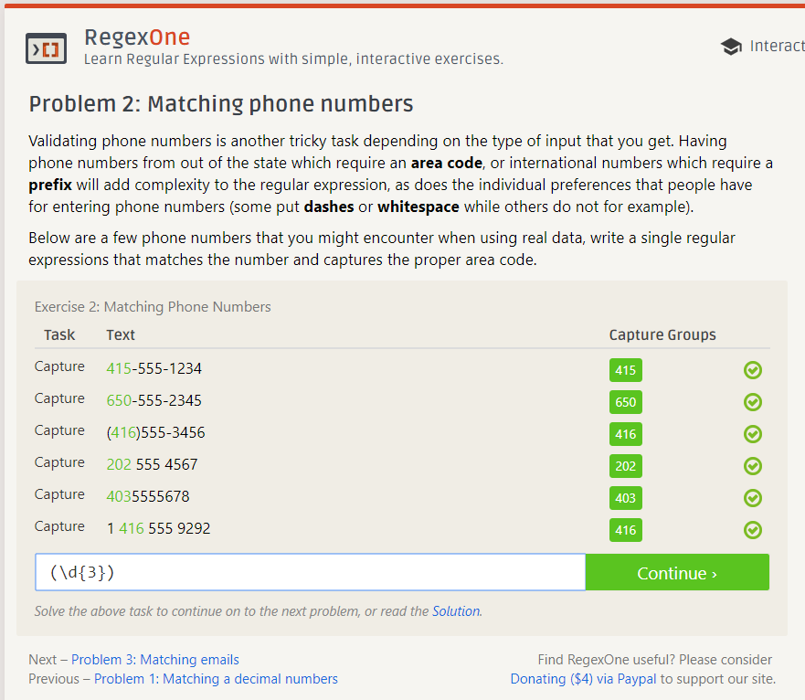
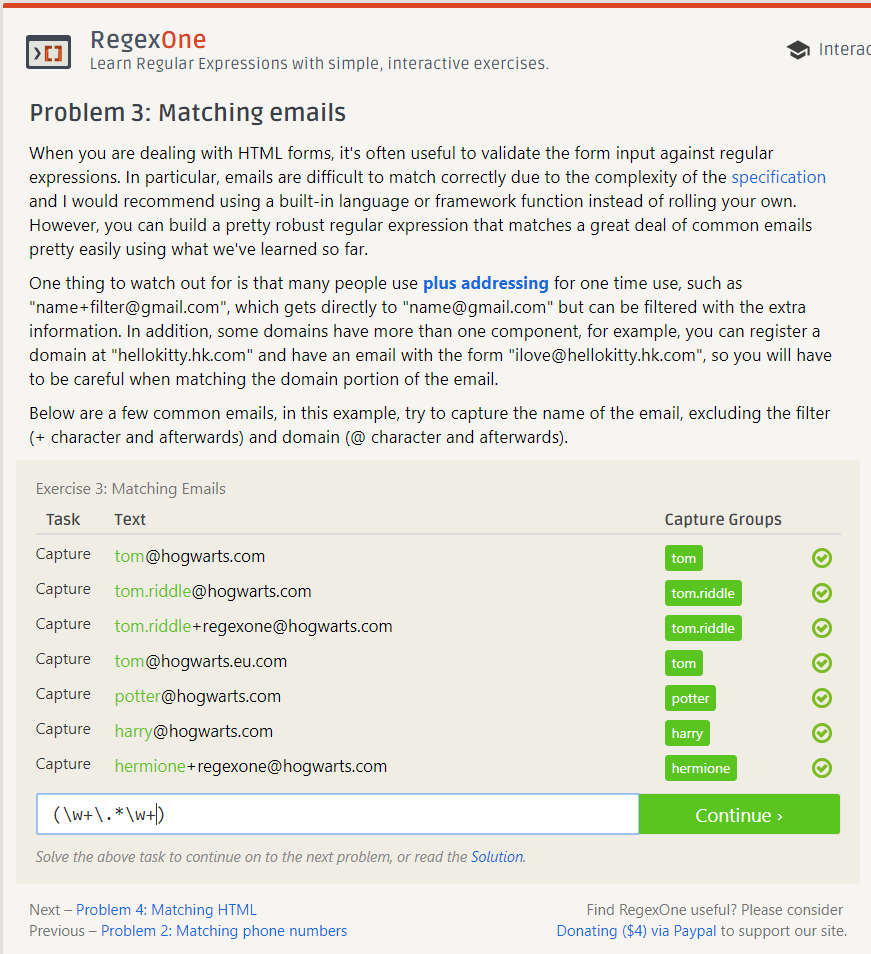
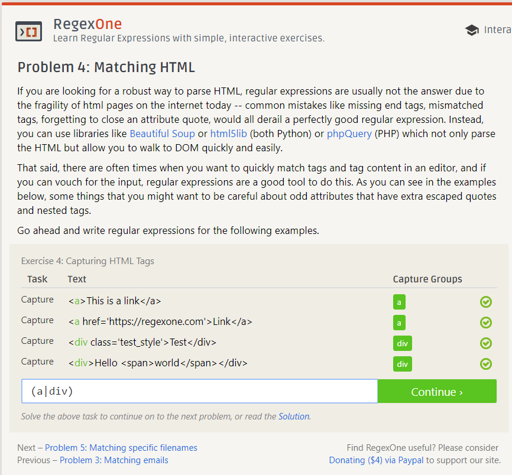
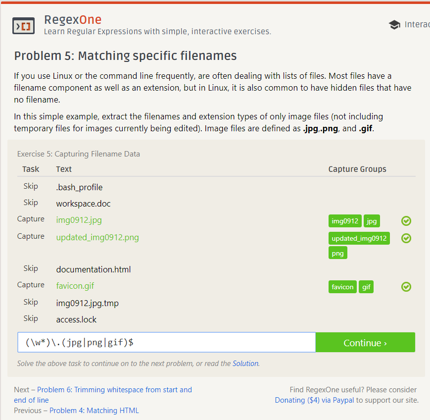
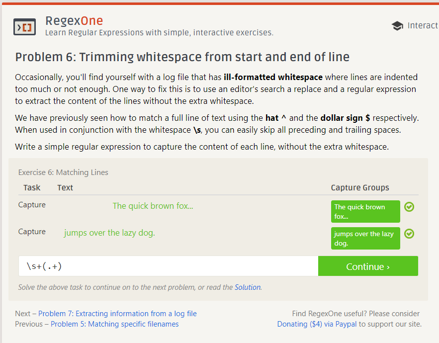
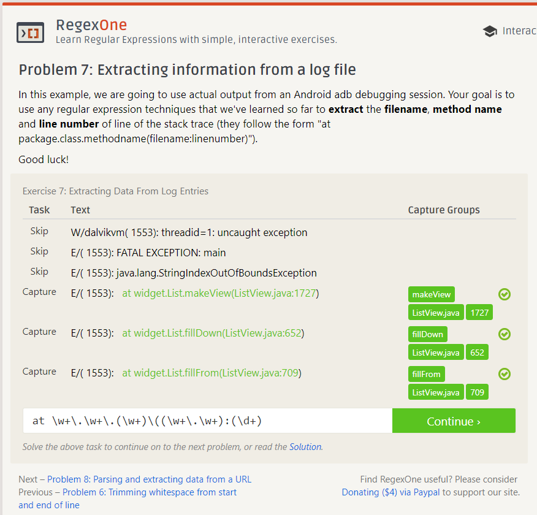
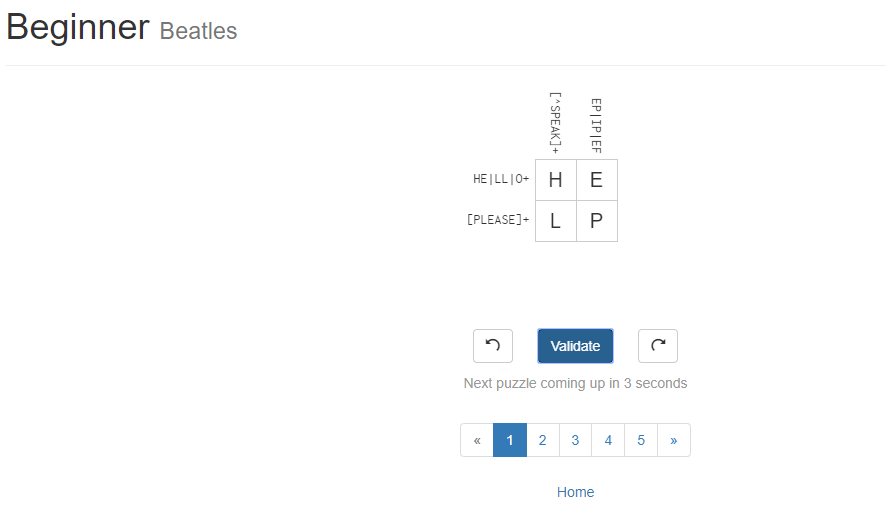

### Lab1.md

## Open Source Definition
This strict criteria for is important for writing and maintaining open source projects, with proper licensing being a high priority.

## Answering Questions in a Helpful Way
1. Don't simply give them the answer to a bad question. Giving someone free code will condition them to continue making bad questions in the future. Give them a gentle nudge in the right direction, and have them come back later when they've research the topic more.
2. Provide step-by-step instructions that are general enough to help more than just the asker. This increases the utility of your answer, and allows it to be useful to more than a single person.

## Free Culture Chapter 3
First, I would like to say that what the RIAA has done is completely bull, and that the American legal system is pretty broken. Jesse built upon the open source content of an older search engine as a pet project. He fixed a bug that caused searches that queried powered down machines to crash the user's system by allowing the user to manually check if the system in question was still actively on the network. To be clear, Jesse continued work on a search engine that he didn't build from the ground up, made it successful, and then proceeded to be sued by the RIAA for files found on other user's local machines that were linked via the search engine. After severe strongarming, Jesse's only remaining options were to fight the case and go bankrupt, or settle and lose all of his savings, along with the placement of severe technological restrictions for the rest of his life. 

## Tree

## Regex

## Regex Crossword
