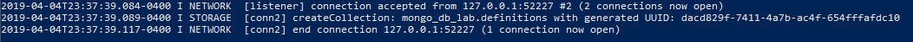

# Lab 10
## Checkpoint 1 - Install MongoDB

## Checkpoint 2 - Loading Data

## Checkpoint 3 - Basic Queries

## Checkpoint 4 - Driving Queries

[checkpoint4.py](scripts/checkpoint4.py)
## Checkpoint 5 - Random Word Requester

[checkpoint5.py](scripts/checkpoint5.py)