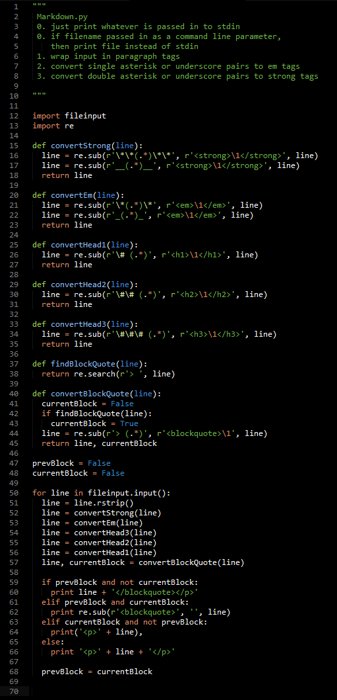
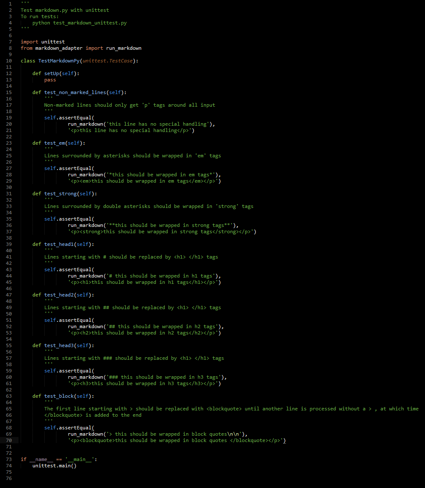
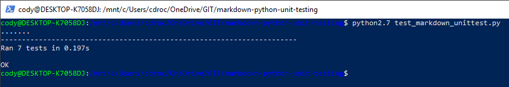

# Lab3

## Part 0 - Documentation

### Areas of interest
There are many areas I would like to explore, including the development of:
1. Game development tools
2. General workflow tools
3. LED lighting programming tools

In particular, some established projects I'm looking to get involved in include:
1. Apache OpenOffice
2. Aurora
3. Nevermore Engine

and I would like to potentially work on a project to add support for the programming of RGB LEDS in Corsair's keyboards using a lightweight scripting language - namely, Lua.

Each of these projects interests me for a different reason. 

In my spare time, I'm a hobbyist game developer and would love to make tools to allow games to be made more organized and their execution more effective. 

I use Apache OpenOffice as an alternative to Microsoft's paid Office suite, and would love to give back by updating it to be more competitive. 

I recently purchased a new Corsair K95 RGB Platinum keyboard for the new PC I've just built, and was very disappointed by the lack of customization their software allowed for controlling the LEDs. 

### LaTeX
[latex](images/Equations.png)

## Part 1 - Community

### RCOS Projects

#### Tornado - A web-first modern torrent client

##### Contributors: 2

##### Lines of code
15872

##### First commit
December 11, 2018

Start project

Commit message: "Started the project and added all the template files and the build configuration."

##### Latest commit
January 28, 2019

Update .gitlab-ci.yml

Commit message: ""

##### Current branches
1

#### Technical Professionalism

##### Contributors: 1

##### Lines of code
0

##### First commit
January 22, 2019

Initial commit

##### Latest commit
January 22, 2019

##### Current branches
1

#### YACS

##### Contributors: 47

##### Lines of code
37856

##### First commit
September 16, 2015

##### Last commit
January 24, 2019

##### Current branches
21

#### Smart Scheduler

##### Contributors: 1

##### Lines of code
0

##### First commit
January 25, 2019

##### Last commit
January 25, 2019

##### Current branches
1

#### Venue

##### Contributors: 11

##### Lines of code
49398

##### First commit
December 15, 2015

##### Last commit
December 11, 2018

##### Current branches
23

### Our Data vs gitstats for Tornado

First commit and last commits match.

Branches match. 

Number of lines originally found: 15872

Number of lines found by gitstats: 15628

### gource videos

[Tornado](https://youtu.be/n5TCfNHC6Rw)

[YACS](https://drive.google.com/open?id=1uc1Nmwl8gpu4GUq2zjCSsQwSQDlyDGZX)

[Technical Professionalism](https://youtu.be/xisdabP4Po0)

[Smart Scheduler](https://drive.google.com/open?id=1J5yZKccYUQ_16OWr4p5acobbEbgc0kIQ)

[Venue](https://drive.google.com/open?id=1VkUsDiXiLyYT-wP3njDbYGDm8DXeM8io)

## Part 2

[Python Unit Testing](https://github.com/Chaotic-Cody/markdown-python-unit-testing)

