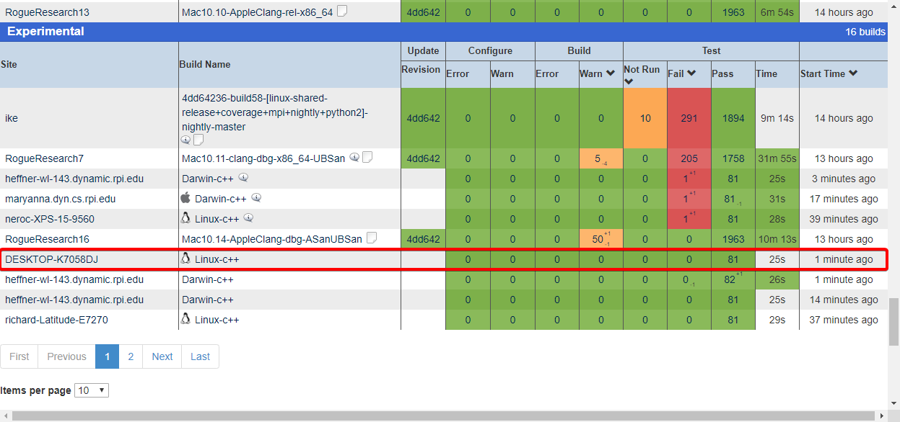
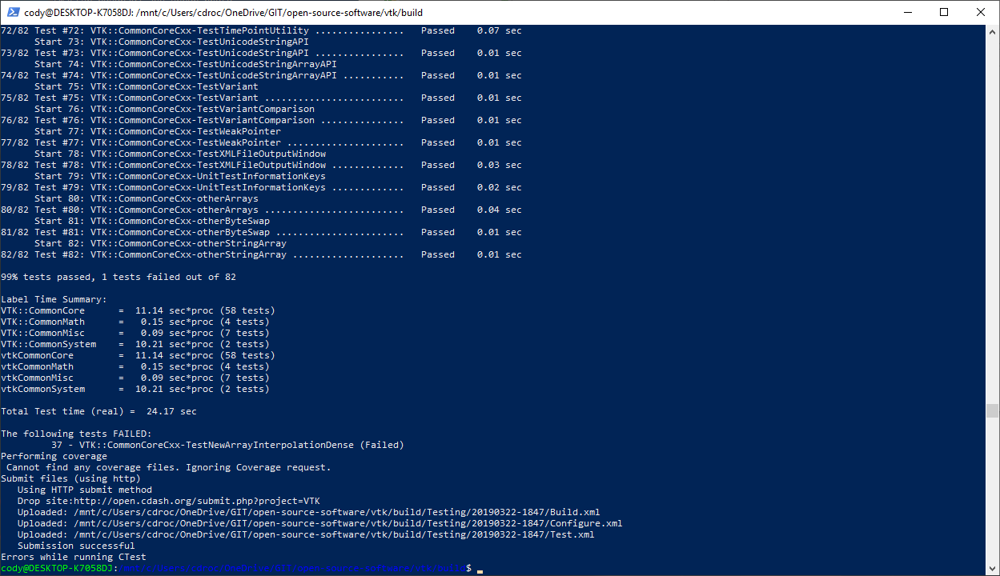
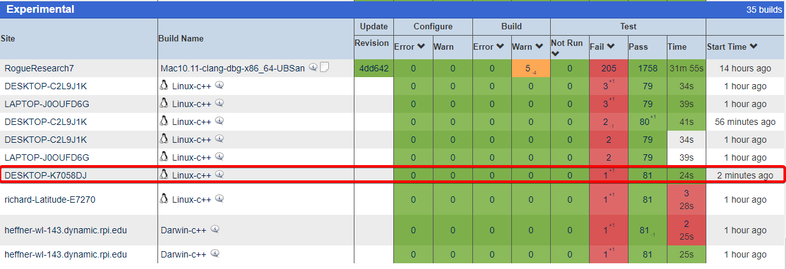
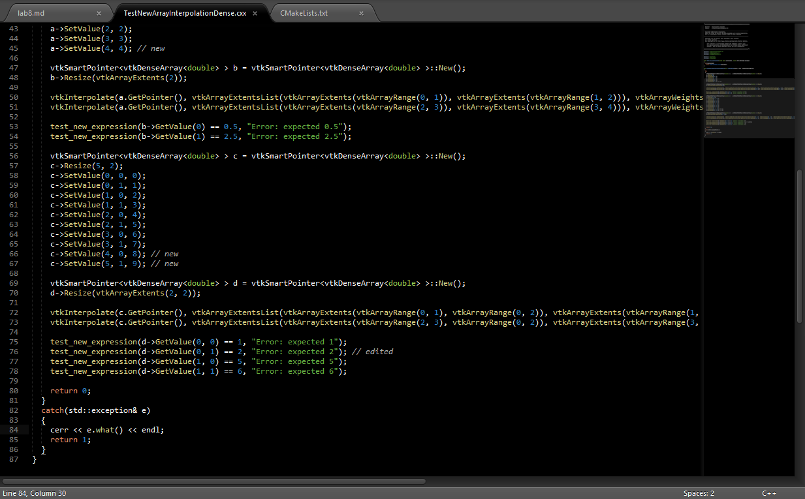

# Lab 8

## Checkpoint 1

## Checkpoint 2

Viewing tests:

Error Submission:

Log shows the file, line number, arguments, and current directory of the error.

Error condition: SIGSEGV & SIGILL

Nightly System:

The linux-shared build is passing all tests, with only 6 warnings.

ctest -D Experimental

There are no errors, all 81 tests pass with my submission.

## Checkpoint 3

TestNewArrayInterpolationDense.cxx failure

Dashboard says "Error: expected 2"

## Checkpoint 4

Debug log:

Changed 'c->SetValue(5, 1, 9);' to 'c->SetValue(4, 1, 9);'

Changed 'test_new_expression(d->GetValue(0, 1) == 4, "Error: expected 2");' to 'test_new_expression(d->GetValue(0, 1) == 2, "Error: expected 2");'

## Checkpoint 5
