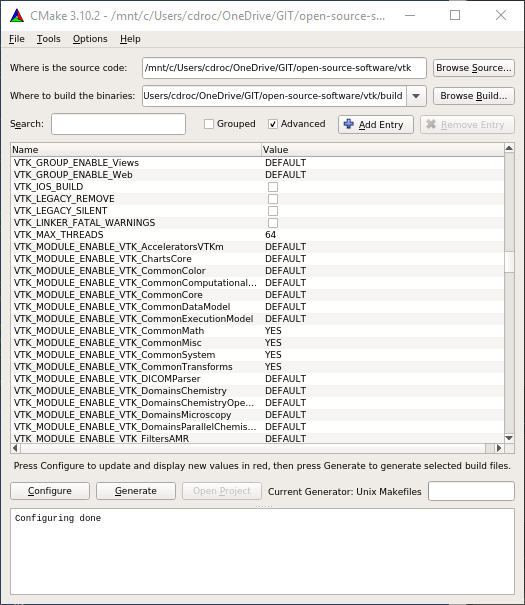
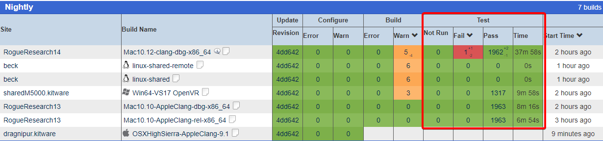
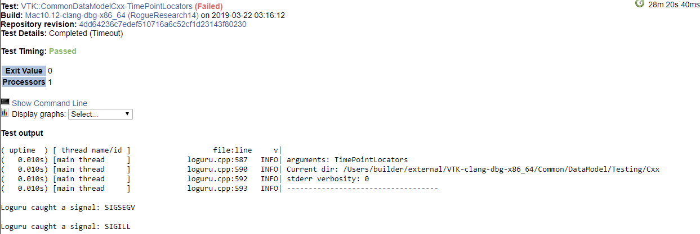
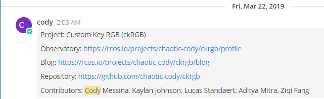

# Lab 8

## Checkpoint 1

## Checkpoint 2

Viewing tests:

Error Submission:
Log shows the file, line number, arguments, and current directory of the error.
Error condition: SIGSEGV & SIGILL

## Checkpoint 5
