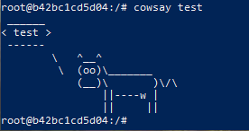
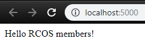

# Lab 9

## Checkpoint 1 - Example00

## Checkpoint 2 - Example01

### Running Ubuntu container

### Installing Vim

### Installing Cowsay

## Checkpoint 3 - Example02

### Running RocketChat

## Checkpoint 4 - Example03

### Build and tun the Dockerfile

### See the web server

## Checkpoint 5 - Example04

