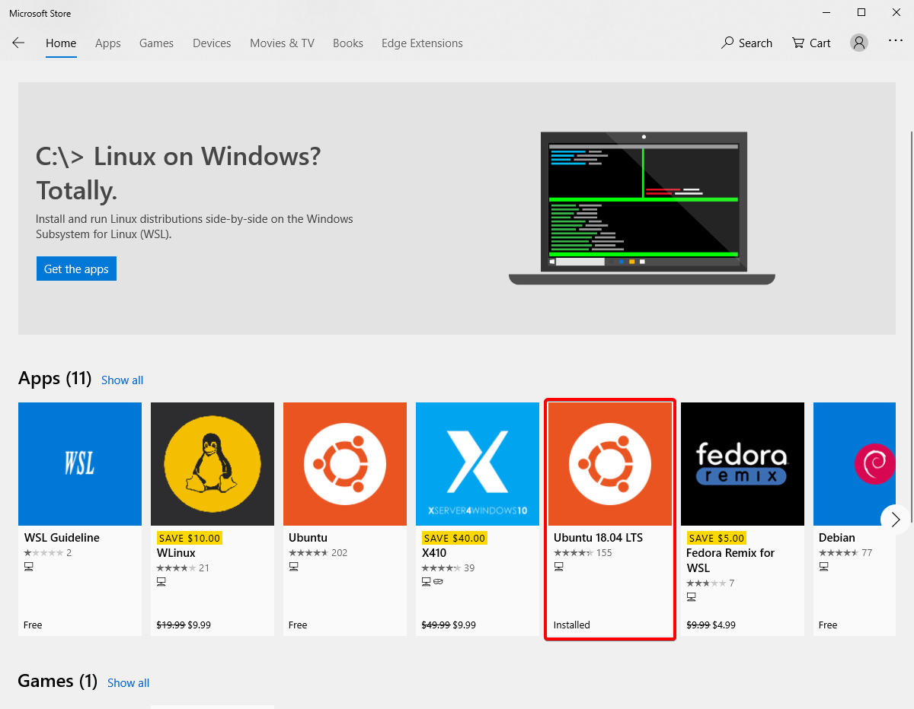

# Using Graphical Interfaces with Windows Subsystem for Linux

## Prerequisites

This tutorial will assume that you have the following:

1. Ubuntu 18.04 LTS or later

2. Windows Powershell or another terminal
3. At least 4 GB of space (this is a generous estimate)
4. Administrative access on the machine
5. Windows 10

## Step 1 - [Install Xming](https://sourceforge.net/projects/xming/) and run it on Windows

Xming is an X server for Windows. In case you want to read more on what an X server actually is, go [here](http://www.linfo.org/x_server.html). For all intents and purposes of this tutorial, all you need to know is that it lets GUIs interface with Windows through WSL.

Note: Once you've installed Xming, you will need to have it running whenever you want to use a GUI through WSL.

## Step 2 - Update your .bashrc file

The .bashrc file contains commands that are run whenever you boot WSL. 

1. Navigate to your .bashrc file by typing 'cd ' into your terminal. This will take you to the root directory.
2. Type in 'nano .bashrc' to open up the file.
3. In nano, navigate to the bottom of the file and type 'export DISPLAY=:0'

4. Ctrl+s to save
5. Ctrl+x to exit nano

## Step 3 - Refresh

There are two ways for the changes you've just made to be reflected in the terminal.

1. Restart WSL
2. Type 'export DISPLAY=:0' into the terminal

## Notes

1. WSL doesn't natively support GUIs, and this is a workaround method that happens to work at this time. Hopefully Microsoft adds support so hacky workarounds like this don't have to exist.
2. Xming doesn't claim to support Windows 10, but it is compatible as of 3/22/2019 on Windows 10 Version 10.0.17763 Build 17763.

## Protips

1. Open your terminal with Administrator access - it'll save you a headache later.

##### Author: Cody Messina 3/22/2019